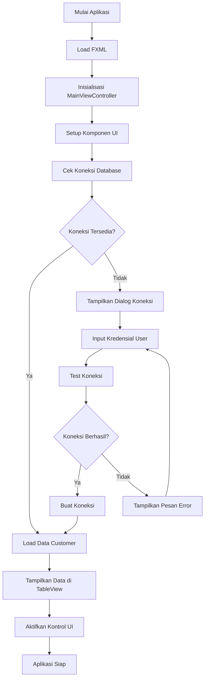
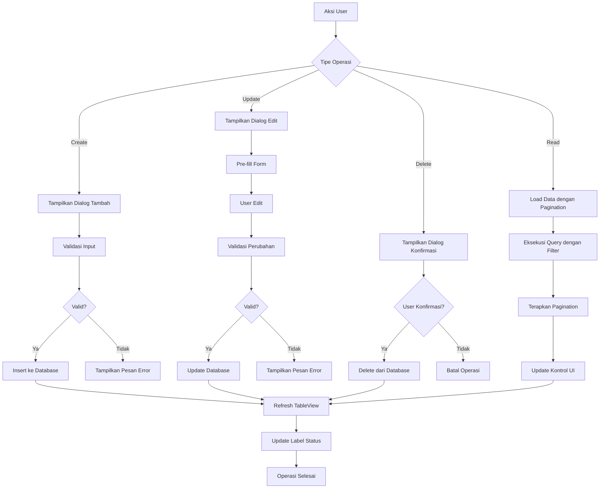
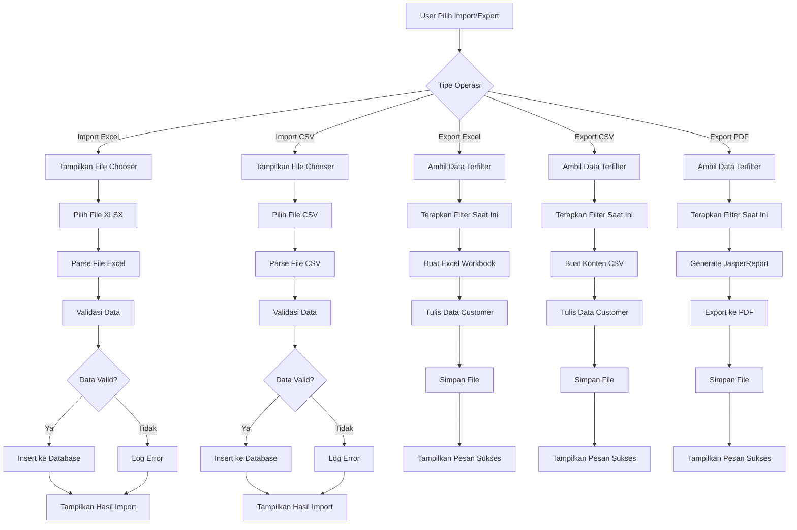
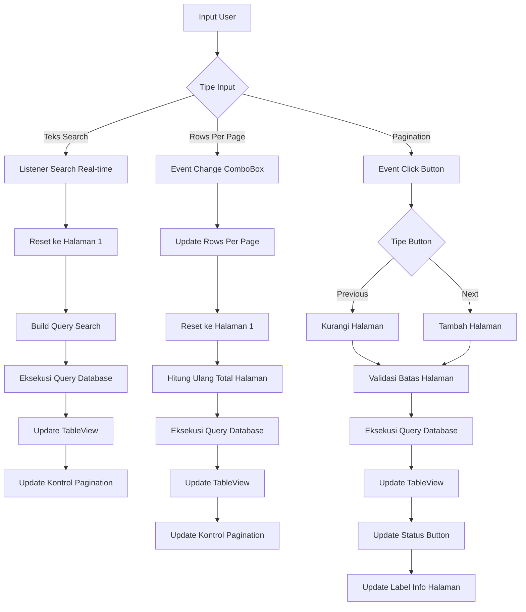

# Sistem Manajemen Customer JavaFX - Dokumentasi Lengkap

## Daftar Isi
1. [Analisis Teknologi](#analisis-teknologi)
2. [Arsitektur Proyek](#arsitektur-proyek)
3. [Diagram Alur Logika](#diagram-alur-logika)
4. [Dokumentasi Proses](#dokumentasi-proses)
5. [Analisis Proses Bisnis](#analisis-proses-bisnis)
6. [Skema Database](#skema-database)
7. [Titik Integrasi](#titik-integrasi)
8. [Build dan Deployment](#build-dan-deployment)

## Analisis Teknologi

### Teknologi Inti

#### Aplikasi Desktop JavaFX 21
- **Framework**: JavaFX 21 dengan arsitektur UI berbasis FXML
- **Sistem Modul**: Java Platform Module System (JPMS) dengan `module-info.java`
- **Komponen UI**: TableView, ComboBox, TextField, Button, DatePicker
- **Event Handling**: Binding event berbasis FXML dengan metode controller
- **Styling**: Styling berbasis CSS dengan dukungan stylesheet eksternal

#### Struktur Proyek Maven 3.9
- **Build Tool**: Maven 3.9 dengan JavaFX Maven Plugin
- **Compiler**: Kompatibilitas Java 21 source dan target
- **Packaging**: JAR modular dengan dukungan jlink untuk packaging native
- **Dependencies**: Manajemen dependency terpusat dengan kontrol versi

#### Integrasi Apache POI 5.4.1
- **Pemrosesan Excel**: Fungsionalitas import/export file XLSX
- **Manajemen Workbook**: XSSFWorkbook untuk dukungan format Excel 2007+
- **Mapping Data**: Mapping entitas Customer ke cell Excel
- **Error Handling**: Tracking error import/export yang komprehensif

#### Integrasi JasperReports 6.20.6
- **Report Engine**: JasperReports dengan implementasi berbasis reflection
- **Sistem Template**: File template JRXML untuk desain laporan
- **Format Export**: Export PDF dengan integrasi file chooser
- **Data Source**: JRBeanCollectionDataSource untuk data customer

#### Integrasi Database MySQL 8
- **Connector**: MySQL Connector/J 9.3.0
- **Manajemen Koneksi**: Pola singleton dengan connection pooling
- **Handling Transaksi**: Mode auto-commit dengan prepared statements
- **Skema**: Desain tabel tunggal dengan data customer komprehensif

#### Implementasi Fitur Java 21
- **Records**: Belum digunakan saat ini namun tersedia untuk enhancement
- **Pattern Matching**: Tersedia untuk switch expressions
- **Text Blocks**: Digunakan dalam formatting SQL query
- **Sealed Classes**: Tersedia untuk hierarki model

## Arsitektur Proyek

### Struktur Package
```
com.tama.jfxcrud/
├── CrudApp.java                    # Entry point aplikasi utama
├── controller/
│   ├── CustomerController.java     # Controller logika bisnis
│   └── MainViewController.java     # Controller event handler UI
├── dao/
│   └── CustomerDAO.java           # Layer akses data
├── model/
│   └── Customer.java              # Model entitas
├── util/
│   ├── DatabaseConnection.java    # Manajemen koneksi database
│   ├── JasperReportsUtil.java     # Utilitas pembuatan laporan
│   ├── ExcelHandler.java          # Import/export Excel
│   └── CSVHandler.java            # Import/export CSV
└── view/
    ├── MainView.java              # Konstruksi UI programmatik
    └── ConnectionSetupView.java   # Dialog koneksi database
```

### Struktur Resources
```
resources/
├── com/tama/jfxcrud/
│   ├── main-view.fxml             # Layout UI utama
│   └── styles.css                 # Styling aplikasi
└── reports/
    ├── customer_report.jrxml      # Template laporan utama
    └── customer_report_simple.jrxml # Template laporan sederhana
```

## Diagram Alur Logika

### Alur Startup Aplikasi


### Alur Operasi CRUD


### Alur Import/Export Data


### Alur Search dan Pagination


## Dokumentasi Proses

### Operasi CRUD Customer

#### Proses Create Customer
1. **Inisiasi User**: Klik tombol "Tambah Customer"
2. **Tampilan Dialog**: Tampilkan dialog input customer dengan form fields
3. **Validasi Data**:
   - NIK: Wajib diisi, constraint unique
   - Nama: Wajib diisi, maksimal 100 karakter
   - Tanggal Lahir: Opsional, validasi date picker
   - Aktif: Checkbox boolean
   - Gaji: Integer, default 0
4. **Insert Database**: Eksekusi statement INSERT dengan prepared statement
5. **Update UI**: Refresh TableView dan tampilkan pesan sukses
6. **Error Handling**: Tampilkan error validasi atau exception database

#### Proses Read Customer (dengan Pagination)
1. **Konstruksi Query**: Build SQL dengan klausa LIMIT, OFFSET, dan WHERE
2. **Binding Parameter**: Bind search terms dan parameter pagination
3. **Eksekusi Database**: Eksekusi query dan count query secara bersamaan
4. **Mapping Data**: Konversi ResultSet ke objek Customer
5. **Populasi UI**: Update TableView dengan data customer
6. **Update Pagination**: Hitung dan update kontrol pagination
7. **Update Status**: Update label info halaman dan jumlah record

#### Proses Update Customer
1. **Validasi Seleksi**: Pastikan customer dipilih di TableView
2. **Pre-fill Dialog**: Load data customer yang ada ke form edit
3. **Modifikasi User**: Izinkan user mengedit field form
4. **Validasi Data**: Aturan validasi sama dengan operasi create
5. **Update Database**: Eksekusi statement UPDATE dengan klausa WHERE
6. **Optimistic Locking**: Cek affected rows untuk memastikan update berhasil
7. **Refresh UI**: Reload data dan tampilkan konfirmasi sukses

#### Proses Delete Customer
1. **Validasi Seleksi**: Pastikan customer dipilih
2. **Dialog Konfirmasi**: Tampilkan konfirmasi delete dengan detail customer
3. **Konfirmasi User**: Tunggu keputusan user
4. **Delete Database**: Eksekusi statement DELETE dengan customer ID
5. **Handling Cascade**: Handle constraint foreign key jika ada
6. **Update UI**: Hapus dari TableView dan tampilkan pesan sukses

### Operasi Import/Export Data

#### Proses Import Excel
1. **Seleksi File**: User memilih file XLSX via FileChooser
2. **Loading Workbook**: Apache POI XSSFWorkbook memuat file
3. **Pemrosesan Sheet**: Baca sheet pertama, skip header row
4. **Iterasi Row**: Proses setiap baris data secara berurutan
5. **Mapping Cell**: Map cell ke field entitas Customer:
   - Kolom 1: NIK (String)
   - Kolom 2: Nama (String)
   - Kolom 3: Tanggal Lahir (Date)
   - Kolom 4: Aktif (Boolean)
   - Kolom 5: Gaji (Integer)
6. **Validasi Data**: Validasi setiap field sesuai aturan bisnis
7. **Insert Database**: Insert record valid, log record gagal
8. **Laporan Hasil**: Tampilkan jumlah sukses/gagal ke user

#### Proses Export Excel
1. **Pengambilan Data**: Ambil data customer terfilter dari view saat ini
2. **Pembuatan Workbook**: Buat instance XSSFWorkbook baru
3. **Setup Header**: Buat header row dengan nama kolom
4. **Populasi Data**: Iterasi customer dan populasi baris
5. **Format Tanggal**: Terapkan format tanggal ke cell tanggal lahir
6. **Penyimpanan File**: Simpan workbook ke lokasi yang dipilih user
7. **Notifikasi Sukses**: Konfirmasi penyelesaian export

#### Proses Pembuatan Laporan PDF
1. **Pengumpulan Data**: Kumpulkan data customer terfilter
2. **Loading Template**: Load template customer_report.jrxml
3. **Kompilasi Laporan**: Kompilasi JRXML ke JasperReport menggunakan reflection
4. **Pembuatan Data Source**: Buat JRBeanCollectionDataSource dari list customer
5. **Setup Parameter**: Set parameter laporan (judul, dibuat oleh, total record)
6. **Pengisian Laporan**: Isi laporan dengan data menggunakan JasperFillManager
7. **Export PDF**: Export JasperPrint ke file PDF
8. **Handling File**: Simpan ke lokasi yang dipilih user atau tampilkan preview

### Operasi Search dan Filtering

#### Proses Search Real-time
1. **Text Listener**: Listener TextField.textProperty() trigger setiap keystroke
2. **Pemrosesan Search Term**: Ekstrak dan trim teks search
3. **Building Query**: Konstruksi SQL dengan klausa LIKE untuk multiple field
4. **Binding Parameter**: Bind search term ke semua field yang bisa dicari:
   - NIK LIKE %searchTerm%
   - Nama LIKE %searchTerm%
   - Tanggal Lahir LIKE %searchTerm%
   - Aktif LIKE %searchTerm%
   - Gaji LIKE %searchTerm%
5. **Reset Pagination**: Reset ke halaman 1 untuk hasil search baru
6. **Query Database**: Eksekusi query terfilter dengan pagination
7. **Update UI**: Update TableView dan kontrol pagination

#### Proses Manajemen Pagination
1. **Kalkulasi Halaman**: Hitung total halaman berdasarkan jumlah record terfilter
2. **Kalkulasi Offset**: Hitung SQL OFFSET = (currentPage - 1) * rowsPerPage
3. **Eksekusi Query**: Eksekusi query pagination dengan LIMIT dan OFFSET
4. **Manajemen Status Button**: Enable/disable tombol Previous/Next
5. **Update Info Halaman**: Update label "Halaman X dari Y (Total record: Z)"
6. **Handling Navigasi**: Proses klik tombol Previous/Next dengan pengecekan batas

## Analisis Proses Bisnis

### Aturan Bisnis Inti

#### Manajemen Data Customer
- **Identifikasi Unik**: NIK harus unik di seluruh customer
- **Field Wajib**: NIK dan Nama wajib diisi untuk semua customer
- **Integritas Data**: Tanggal lahir tidak boleh di masa depan
- **Manajemen Status**: Flag aktif menentukan status operasional customer
- **Tracking Finansial**: Field gaji untuk manajemen kompensasi

#### Aturan Import/Export Data
- **Operasi Terfilter**: Semua operasi export bekerja pada data yang sedang difilter/dicari
- **Toleransi Error**: Operasi import melanjutkan pemrosesan meskipun ada record individual yang gagal
- **Validasi Data**: Validasi ketat selama import untuk menjaga kualitas data
- **Audit Trail**: Operasi import/export menyediakan laporan sukses/gagal yang detail

#### Aturan User Interface
- **Dependency Koneksi**: Semua operasi data memerlukan koneksi database aktif
- **Feedback Real-time**: Search dan pagination memberikan feedback visual langsung
- **Error Handling**: Pesan error yang user-friendly untuk semua skenario kegagalan
- **Konsistensi Data**: UI selalu mencerminkan state database saat ini setelah operasi

### Skenario User

#### Skenario 1: Registrasi Customer Baru
1. **Konteks**: Departemen HR perlu mendaftarkan karyawan baru
2. **Proses**: Gunakan dialog Tambah Customer untuk input detail karyawan
3. **Validasi**: Sistem validasi keunikan NIK dan field wajib
4. **Hasil**: Record customer baru dibuat dengan status aktif

#### Skenario 2: Import Data Bulk
1. **Konteks**: Migrasi dari sistem legacy dengan data Excel
2. **Proses**: Gunakan fungsionalitas import Excel untuk memproses data bulk
3. **Validasi**: Sistem validasi setiap record dan melaporkan kegagalan
4. **Hasil**: Record valid diimport, record invalid dicatat untuk koreksi

#### Skenario 3: Pembuatan Laporan Customer
1. **Konteks**: Manajemen memerlukan laporan customer untuk kriteria spesifik
2. **Proses**: Terapkan filter search, kemudian export ke PDF
3. **Validasi**: Sistem memastikan hanya data terfilter yang disertakan
4. **Hasil**: Laporan PDF dibuat dengan kriteria filter saat ini

#### Skenario 4: Maintenance Data
1. **Konteks**: Maintenance data customer rutin dan cleanup
2. **Proses**: Gunakan search untuk menemukan customer spesifik, edit/delete sesuai kebutuhan
3. **Validasi**: Sistem konfirmasi operasi destruktif
4. **Hasil**: Data customer dimaintain dengan audit trail

## Skema Database

### Struktur Tabel Customer
```sql
CREATE TABLE customer (
    idx INT AUTO_INCREMENT PRIMARY KEY,
    nik VARCHAR(20) NOT NULL UNIQUE,
    name VARCHAR(100) NOT NULL,
    born DATE,
    active BOOLEAN DEFAULT TRUE,
    salary INT DEFAULT 0
);
```

#### Spesifikasi Field
- **idx**: Primary key auto-increment untuk identifikasi internal
- **nik**: Nomor Identitas Kependudukan, unique business key
- **name**: Nama lengkap customer, field wajib
- **born**: Tanggal lahir, field opsional untuk kalkulasi umur
- **active**: Flag status untuk customer operasional
- **salary**: Jumlah kompensasi dalam format integer

#### Index dan Constraint
- **Primary Key**: Field idx untuk lookup cepat
- **Unique Constraint**: Field nik untuk mencegah duplikasi
- **NOT NULL Constraints**: Field nik dan name wajib diisi
- **Default Values**: active=TRUE, salary=0 untuk record baru

### Manajemen Koneksi Database
- **Connection String**: `jdbc:mysql://localhost:3306/test`
- **Driver**: MySQL Connector/J 9.3.0
- **Connection Pooling**: Pola singleton dengan validasi koneksi
- **Manajemen Transaksi**: Mode auto-commit dengan prepared statements
- **Error Handling**: Logic retry koneksi dengan feedback user

## Titik Integrasi

### Integrasi JavaFX dan FXML
- **Loading FXML**: FXMLLoader memuat main-view.fxml saat startup aplikasi
- **Binding Controller**: Anotasi @FXML mengikat komponen UI ke field controller
- **Event Handling**: Atribut onAction FXML menghubungkan ke metode controller
- **CSS Styling**: Integrasi stylesheet eksternal untuk theming UI konsisten
- **Manajemen Resource**: Resource dimuat dari classpath dengan akses modul yang tepat

### Integrasi Apache POI
- **Manajemen Dependency**: Artifact POI dan POI-OOXML di Maven POM
- **Operasi Workbook**: XSSFWorkbook untuk handling format Excel 2007+
- **Handling Tipe Cell**: Deteksi dan konversi otomatis tipe cell
- **Format Tanggal**: Format cell tanggal yang tepat dengan CellStyle
- **Recovery Error**: Handling graceful untuk file Excel yang malformed

### Integrasi JasperReports
- **Loading Berbasis Reflection**: Loading dinamis untuk menghindari dependency langsung
- **Manajemen Template**: Template JRXML disimpan di resources/reports
- **Integrasi Data Source**: JRBeanCollectionDataSource untuk binding objek Java
- **Kapabilitas Export**: Export PDF dengan integrasi file chooser
- **Passing Parameter**: Injeksi parameter dinamis untuk kustomisasi laporan

### Integrasi Database MySQL
- **Driver JDBC**: MySQL Connector/J dengan kompatibilitas versi yang tepat
- **Manajemen Koneksi**: Pola singleton dengan validasi koneksi
- **Prepared Statements**: Pencegahan SQL injection dengan query berparameter
- **Handling Transaksi**: Mode auto-commit dengan kapabilitas rollback
- **Error Handling**: Penangkapan SQLException dengan pesan user-friendly

## Build dan Deployment

### Konfigurasi Maven

#### Properties Proyek
```xml
<properties>
    <maven.compiler.source>21</maven.compiler.source>
    <maven.compiler.target>21</maven.compiler.target>
    <javafx.version>21</javafx.version>
    <junit.version>5.10.0</junit.version>
</properties>
```

#### Dependencies Utama
- **JavaFX**: Modul Controls, FXML, Web, Swing
- **Apache POI**: Core POI dan OOXML untuk pemrosesan Excel
- **MySQL**: Connector/J untuk konektivitas database
- **JasperReports**: Core engine dan fonts
- **Logging**: Log4j untuk logging JasperReports

#### Build Plugins
- **Maven Compiler Plugin**: Konfigurasi Java 21 source/target
- **JavaFX Maven Plugin**: Eksekusi dan packaging aplikasi
- **Maven Wrapper**: Disertakan untuk environment build yang konsisten

### Eksekusi Aplikasi

#### Mode Development
```bash
mvn clean javafx:run
```

#### Packaging Production
```bash
mvn clean package
mvn javafx:jlink
```

#### Konfigurasi Sistem Modul
- **module-info.java**: Mendefinisikan dependency dan export modul
- **Automatic Modules**: Menangani dependency non-modular
- **Service Loading**: Akses modul yang tepat untuk operasi berbasis reflection

### Pertimbangan Deployment

#### Kebutuhan Sistem
- **Java Runtime**: Java 21 atau lebih tinggi
- **Database**: MySQL 8.0 atau kompatibel
- **Memory**: Minimum 512MB heap untuk dataset besar
- **Storage**: Ruang yang memadai untuk file temporary dan export

#### Manajemen Konfigurasi
- **Koneksi Database**: Dapat dikonfigurasi melalui dialog koneksi
- **Path File**: Path yang dapat dipilih user untuk operasi import/export
- **Template Laporan**: Dibundle dalam resource aplikasi
- **Logging**: Level log yang dapat dikonfigurasi untuk debugging

#### Optimisasi Performa
- **Connection Pooling**: Manajemen koneksi database singleton
- **Lazy Loading**: Loading resource on-demand
- **Manajemen Memory**: Cleanup dan disposal resource yang tepat
- **Pagination**: Loading data efisien dengan query LIMIT/OFFSET

## Contoh Implementasi Kode

### Metode Controller Utama

#### Event Handler MainViewController
```java
@FXML
private void handleUploadExcel() {
    if (!DatabaseConnection.isConnected()) {
        showNotConnectedAlert();
        return;
    }

    FileChooser fileChooser = new FileChooser();
    fileChooser.setTitle("Pilih File Excel");
    fileChooser.getExtensionFilters().add(new FileChooser.ExtensionFilter("File Excel", "*.xlsx"));
    File file = fileChooser.showOpenDialog(primaryStage);

    if (file != null) {
        Map<String, Integer> result = controller.importExcel(file);
        showAlert(Alert.AlertType.INFORMATION, "Hasil Import", "Import Excel Selesai",
                String.format("Berhasil diimport: %d record\nGagal diimport: %d record",
                        result.get("success"), result.get("failed")));
        loadData();
    }
}

@FXML
private void handleExportPDF() {
    try {
        List<Customer> filteredCustomers = controller.getCustomers(totalRecords, 0, currentSearch);

        if (filteredCustomers.isEmpty()) {
            showAlert(Alert.AlertType.INFORMATION, "Tidak Ada Data", "Tidak Ada Data untuk Export",
                     "Tidak ada customer untuk diexport ke PDF berdasarkan filter saat ini.");
            return;
        }

        // Export ke PDF - hanya bekerja pada data terfilter
        JasperReportsUtil.exportToPDF(filteredCustomers, primaryStage);

    } catch (SQLException e) {
        showAlert(Alert.AlertType.ERROR, "Error Database", "Gagal memuat data untuk export", e.getMessage());
    }
}
```

#### Implementasi CRUD CustomerDAO
```java
public List<Customer> getAllCustomers(int limit, int offset, String searchTerm) throws SQLException {
    List<Customer> customers = new ArrayList<>();
    String query = "SELECT * FROM customer WHERE 1=1";

    if (searchTerm != null && !searchTerm.isEmpty()) {
        query += " AND (nik LIKE ? OR name LIKE ? OR born LIKE ? OR CAST(active AS CHAR) LIKE ? OR CAST(salary AS CHAR) LIKE ?)";
    }

    query += " ORDER BY idx LIMIT ? OFFSET ?";

    Connection conn = DatabaseConnection.getConnection();
    try (PreparedStatement stmt = conn.prepareStatement(query)) {
        int paramIndex = 1;

        if (searchTerm != null && !searchTerm.isEmpty()) {
            String searchPattern = "%" + searchTerm + "%";
            for (int i = 0; i < 5; i++) {
                stmt.setString(paramIndex++, searchPattern);
            }
        }

        stmt.setInt(paramIndex++, limit);
        stmt.setInt(paramIndex, offset);

        ResultSet rs = stmt.executeQuery();
        while (rs.next()) {
            Customer customer = new Customer();
            customer.setIdx(rs.getInt("idx"));
            customer.setNik(rs.getString("nik"));
            customer.setName(rs.getString("name"));

            Date bornDate = rs.getDate("born");
            if (bornDate != null) {
                customer.setBorn(bornDate.toLocalDate());
            }

            customer.setActive(rs.getBoolean("active"));
            customer.setSalary(rs.getInt("salary"));
            customers.add(customer);
        }
    }

    return customers;
}

public void addCustomer(Customer customer) throws SQLException {
    String query = "INSERT INTO customer (nik, name, born, active, salary) VALUES (?, ?, ?, ?, ?)";

    Connection conn = DatabaseConnection.getConnection();
    try (PreparedStatement stmt = conn.prepareStatement(query)) {
        stmt.setString(1, customer.getNik());
        stmt.setString(2, customer.getName());
        stmt.setDate(3, customer.getBorn() != null ? Date.valueOf(customer.getBorn()) : null);
        stmt.setBoolean(4, customer.isActive());
        stmt.setInt(5, customer.getSalary());

        stmt.executeUpdate();
    }
}
```

#### Implementasi Reflection JasperReports
```java
private static void compileReport() throws Exception {
    if (compiledReport == null) {
        InputStream reportStream = JasperReportsUtil.class.getResourceAsStream(REPORT_TEMPLATE);
        if (reportStream == null) {
            reportStream = JasperReportsUtil.class.getClassLoader().getResourceAsStream("reports/customer_report_simple.jrxml");
            if (reportStream == null) {
                throw new Exception("Template laporan tidak ditemukan: " + REPORT_TEMPLATE);
            }
        }

        try {
            // Gunakan reflection untuk kompilasi laporan
            Class<?> compileManagerClass = Class.forName("net.sf.jasperreports.engine.JasperCompileManager");
            var compileMethod = compileManagerClass.getMethod("compileReport", InputStream.class);
            compiledReport = compileMethod.invoke(null, reportStream);
        } finally {
            if (reportStream != null) {
                reportStream.close();
            }
        }
    }
}

public static Object generateReport(List<Customer> customers) throws Exception {
    compileReport();

    // Konversi customer ke format Map untuk handling yang lebih mudah
    List<Map<String, Object>> customerMaps = new ArrayList<>();
    for (Customer customer : customers) {
        Map<String, Object> customerMap = new HashMap<>();
        customerMap.put("idx", customer.getIdx());
        customerMap.put("nik", customer.getNik());
        customerMap.put("name", customer.getName());
        customerMap.put("born", customer.getBorn() != null ? customer.getBorn().toString() : "");
        customerMap.put("active", customer.isActive());
        customerMap.put("salary", customer.getSalary());
        customerMaps.add(customerMap);
    }

    // Buat data source menggunakan reflection
    Class<?> dataSourceClass = Class.forName("net.sf.jasperreports.engine.data.JRBeanCollectionDataSource");
    var dataSourceConstructor = dataSourceClass.getConstructor(java.util.Collection.class);
    Object dataSource = dataSourceConstructor.newInstance(customerMaps);

    // Buat map parameter
    Map<String, Object> parameters = new HashMap<>();
    parameters.put("ReportTitle", "Laporan Manajemen Customer");
    parameters.put("GeneratedBy", "Sistem Manajemen Customer");
    parameters.put("TotalRecords", customers.size());

    // Isi laporan menggunakan reflection
    Class<?> fillManagerClass = Class.forName("net.sf.jasperreports.engine.JasperFillManager");
    var fillMethod = fillManagerClass.getMethod("fillReport",
        Class.forName("net.sf.jasperreports.engine.JasperReport"),
        Map.class,
        Class.forName("net.sf.jasperreports.engine.JRDataSource"));

    return fillMethod.invoke(null, compiledReport, parameters, dataSource);
}
```

### Manajemen Koneksi Database
```java
public class DatabaseConnection {
    private static String URL = "jdbc:mysql://localhost:3306/test";
    private static String USER = "rangga";
    private static String PASSWORD = "rangga";

    private static Connection connection;

    public static Connection getConnection() throws SQLException {
        if (connection == null || connection.isClosed() || !connection.isValid(5)) {
            connection = DriverManager.getConnection(URL, USER, PASSWORD);
        }
        return connection;
    }

    public static boolean isConnected() {
        if (connection == null) return false;
        try {
            boolean closed = connection.isClosed();
            boolean valid = connection.isValid(5); // 5 detik timeout
            return !closed && valid;
        } catch (SQLException e) {
            return false;
        }
    }

    public static void setConnectionParams(String host, String port, String database, String user, String password) {
        URL = String.format("jdbc:mysql://%s:%s/%s", host, port, database);
        USER = user;
        PASSWORD = password;
        closeConnection();
    }
}
```

## Panduan Setup dan Konfigurasi

### Prasyarat
1. **Java 21** - Download dari Oracle atau OpenJDK
2. **Maven 3.9+** - Untuk manajemen build
3. **MySQL 8.0+** - Server database
4. **IDE** - IntelliJ IDEA direkomendasikan

### Setup Database
```sql
-- 1. Buat database
CREATE DATABASE IF NOT EXISTS test;
USE test;

-- 2. Buat tabel customer
CREATE TABLE customer (
    idx INT AUTO_INCREMENT PRIMARY KEY,
    nik VARCHAR(20) NOT NULL UNIQUE,
    name VARCHAR(100) NOT NULL,
    born DATE,
    active BOOLEAN DEFAULT TRUE,
    salary INT DEFAULT 0
);

-- 3. Insert data sample
INSERT INTO customer (nik, name, born, active, salary) VALUES
('1234567890123456', 'John Doe', '1990-01-15', TRUE, 5000000),
('2345678901234567', 'Jane Smith', '1985-03-22', TRUE, 7500000),
('3456789012345678', 'Bob Johnson', '1992-07-10', FALSE, 4500000);
```

### Setup Proyek
```bash
# 1. Clone atau extract proyek
cd /path/to/CrudJFX

# 2. Verifikasi versi Java
java --version

# 3. Build proyek
mvn clean compile

# 4. Jalankan aplikasi
mvn javafx:run
```

### File Konfigurasi

#### module-info.java
```java
module com.tama.jfxcrud {
    requires javafx.controls;
    requires javafx.fxml;
    requires javafx.web;
    requires javafx.swing;

    requires java.sql;
    requires java.desktop;
    requires org.apache.poi.poi;
    requires org.apache.poi.ooxml;

    opens com.tama.jfxcrud to javafx.fxml;
    opens com.tama.jfxcrud.controller to javafx.fxml;
    opens com.tama.jfxcrud.view to javafx.fxml;

    exports com.tama.jfxcrud;
    exports com.tama.jfxcrud.model;
    exports com.tama.jfxcrud.controller;
    exports com.tama.jfxcrud.view;
}
```

#### Dependencies Maven Utama
```xml
<!-- JavaFX -->
<dependency>
    <groupId>org.openjfx</groupId>
    <artifactId>javafx-controls</artifactId>
    <version>21</version>
</dependency>

<!-- Apache POI untuk Excel -->
<dependency>
    <groupId>org.apache.poi</groupId>
    <artifactId>poi</artifactId>
    <version>5.4.1</version>
</dependency>
<dependency>
    <groupId>org.apache.poi</groupId>
    <artifactId>poi-ooxml</artifactId>
    <version>5.4.1</version>
</dependency>

<!-- MySQL Connector -->
<dependency>
    <groupId>com.mysql</groupId>
    <artifactId>mysql-connector-j</artifactId>
    <version>9.3.0</version>
</dependency>

<!-- JasperReports -->
<dependency>
    <groupId>net.sf.jasperreports</groupId>
    <artifactId>jasperreports</artifactId>
    <version>6.20.6</version>
</dependency>
```

## Panduan Troubleshooting

### Masalah Umum dan Solusi

#### 1. Masalah Koneksi Database
**Masalah**: "Connection refused" atau "Access denied"
**Solusi**:
- Verifikasi server MySQL berjalan: `sudo systemctl status mysql`
- Cek parameter koneksi di DatabaseConnection.java
- Pastikan user memiliki privilege yang tepat: `GRANT ALL PRIVILEGES ON test.* TO 'rangga'@'localhost';`
- Test koneksi manual: `mysql -u rangga -p -h localhost test`

#### 2. Masalah Modul JavaFX
**Masalah**: Error "Module not found"
**Solusi**:
- Verifikasi Java 21 terinstall dan JAVA_HOME di-set
- Cek module-info.java untuk statement requires yang hilang
- Pastikan modul JavaFX ada di module path
- Gunakan Maven wrapper: `./mvnw javafx:run`

#### 3. Masalah JasperReports
**Masalah**: "Template not found" atau error reflection
**Solusi**:
- Verifikasi file JRXML ada di src/main/resources/reports/
- Cek dependencies JasperReports di pom.xml
- Pastikan akses modul yang tepat untuk reflection
- Test dengan template sederhana terlebih dahulu

#### 4. Masalah Import/Export Excel
**Masalah**: "File format not supported" atau error POI
**Solusi**:
- Verifikasi file berformat .xlsx (bukan .xls)
- Cek dependencies Apache POI
- Pastikan permission file yang tepat
- Validasi struktur file Excel sesuai format yang diharapkan

#### 5. Masalah Build
**Masalah**: Error kompilasi Maven
**Solusi**:
- Clean dan rebuild: `mvn clean compile`
- Update dependencies: `mvn dependency:resolve`
- Cek kompatibilitas versi Java
- Verifikasi versi Maven: `mvn --version`

### Optimisasi Performa

#### Optimisasi Memory
```bash
# Tingkatkan heap size untuk dataset besar
export MAVEN_OPTS="-Xmx2g -Xms512m"
mvn javafx:run
```

#### Optimisasi Database
```sql
-- Tambah index untuk performa search yang lebih baik
CREATE INDEX idx_customer_nik ON customer(nik);
CREATE INDEX idx_customer_name ON customer(name);
CREATE INDEX idx_customer_active ON customer(active);
```

#### Optimisasi Aplikasi
- Gunakan pagination untuk dataset besar (sudah diimplementasi)
- Implementasi connection pooling untuk production
- Cache template JasperReports yang sudah dikompilasi
- Optimisasi pemrosesan Excel untuk file besar

## Checklist Reverse Engineering

### Untuk Developer Baru

#### Memahami Codebase
- [ ] Review struktur package dan tanggung jawab class
- [ ] Pahami implementasi pola MVC
- [ ] Pelajari skema database dan relasi
- [ ] Analisis konfigurasi build Maven
- [ ] Review konfigurasi sistem modul

#### Pola Implementasi Utama
- [ ] **Pola Singleton**: Class DatabaseConnection
- [ ] **Pola DAO**: CustomerDAO untuk akses data
- [ ] **Pola MVC**: Pemisahan concern
- [ ] **Pola Observer**: Event handling JavaFX
- [ ] **Pola Factory**: Pembuatan FileChooser dan Alert

#### Titik Integrasi Kritis
- [ ] **Binding FXML**: Anotasi @FXML dan event handler
- [ ] **Penggunaan Reflection**: Loading dinamis JasperReports
- [ ] **Manajemen Resource**: Cleanup dan disposal yang tepat
- [ ] **Error Handling**: Handling SQLException dan IOException
- [ ] **Validasi Data**: Validasi input dan aturan bisnis

#### Strategi Testing
- [ ] Unit test untuk metode DAO
- [ ] Integration test untuk operasi database
- [ ] UI test untuk komponen JavaFX
- [ ] End-to-end test untuk fungsionalitas import/export
- [ ] Performance test untuk dataset besar

### Titik Ekstensi

#### Menambah Fitur Baru
1. **Tipe Entitas Baru**: Ikuti pola model Customer
2. **Laporan Tambahan**: Buat template JRXML baru
3. **Format Export Baru**: Extend pola handler
4. **Enhanced Search**: Modifikasi query building DAO
5. **Manajemen User**: Tambah layer autentikasi

#### Area Kustomisasi
1. **Tema UI**: Modifikasi styles.css
2. **Skema Database**: Extend tabel customer
3. **Template Laporan**: Kustomisasi file JRXML
4. **Parameter Koneksi**: Konfigurasi berbasis environment
5. **Aturan Validasi**: Kustomisasi logika bisnis

## Maintenance Dokumentasi

### Menjaga Dokumentasi Tetap Update
1. **Perubahan Kode**: Update contoh saat implementasi berubah
2. **Update Dependencies**: Maintain matriks kompatibilitas versi
3. **Fitur Baru**: Dokumentasikan fungsionalitas dan titik integrasi baru
4. **Bug Fixes**: Update panduan troubleshooting
5. **Peningkatan Performa**: Dokumentasikan teknik optimisasi

### Riwayat Versi
- **v1.0**: Implementasi awal dengan CRUD dasar
- **v1.1**: Tambah fungsionalitas pagination dan search
- **v1.2**: Implementasi import/export Excel
- **v1.3**: Tambah pembuatan PDF JasperReports
- **v1.4**: Enhanced error handling dan validasi
- **Saat Ini**: Dokumentasi komprehensif untuk reverse engineering

## Ringkasan Fitur Utama

### Fungsionalitas Inti
✅ **Operasi CRUD**: Create, Read, Update, Delete lengkap untuk customer
✅ **Search & Filter**: Search real-time di semua field customer
✅ **Pagination**: Kontrol rows per page yang dapat dikonfigurasi dengan navigasi
✅ **Import Data**: Import file Excel dan CSV dengan validasi
✅ **Export Data**: Export Excel, CSV, dan PDF dari data terfilter
✅ **Pembuatan Laporan**: Laporan PDF berbasis JasperReports
✅ **Manajemen Database**: Integrasi MySQL dengan manajemen koneksi

### Highlight Teknis
✅ **Java Modern**: Java 21 dengan dukungan sistem modul
✅ **JavaFX 21**: JavaFX terbaru dengan UI berbasis FXML
✅ **Build Maven**: Build dan manajemen dependency komprehensif
✅ **Error Handling**: Error handling robust dengan feedback user
✅ **Penggunaan Reflection**: Loading dinamis untuk dependency opsional
✅ **Manajemen Resource**: Cleanup dan manajemen memory yang tepat

### Fitur User Experience
✅ **UI Intuitif**: Desain interface yang bersih dan responsif
✅ **Feedback Real-time**: Respons langsung terhadap aksi user
✅ **Validasi Data**: Validasi input yang komprehensif
✅ **Indikasi Progress**: Feedback yang jelas untuk operasi long-running
✅ **Pesan Error**: Pelaporan error yang user-friendly
✅ **Navigasi Keyboard**: Dukungan aksesibilitas keyboard penuh

### Fitur Khusus Sesuai Preferensi
✅ **Export Data Terfilter**: Semua operasi export/print bekerja pada data yang sedang difilter/dicari (sesuai preferensi user)
✅ **Search Real-time**: Filter data langsung saat mengetik
✅ **Pagination Efisien**: Loading data dengan LIMIT/OFFSET untuk performa optimal
✅ **Error Tolerance**: Import melanjutkan pemrosesan meskipun ada record yang gagal

Dokumentasi komprehensif ini menyediakan panduan lengkap untuk memahami, maintain, dan extend Sistem Manajemen Customer JavaFX. Dokumentasi ini berfungsi sebagai referensi lengkap untuk reverse engineering dan pengembangan berkelanjutan yang sukses.
