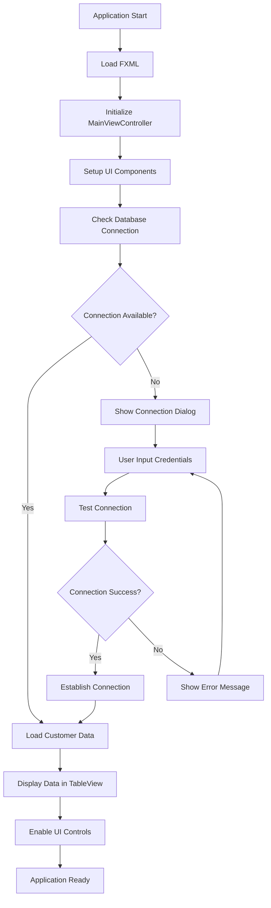
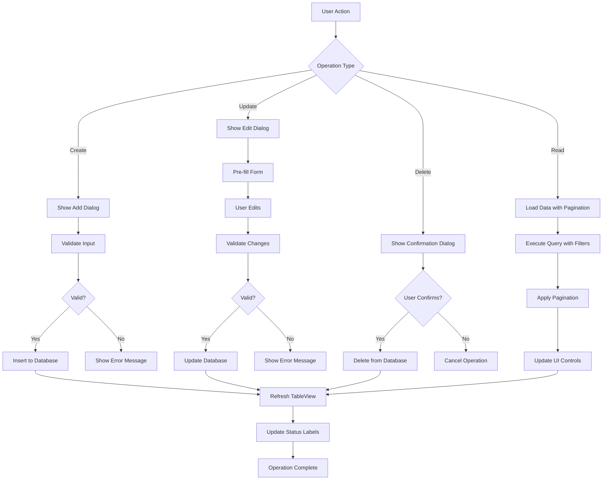
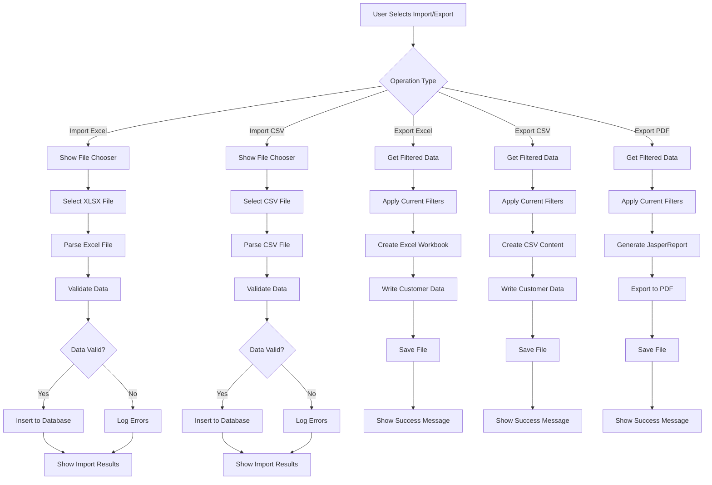
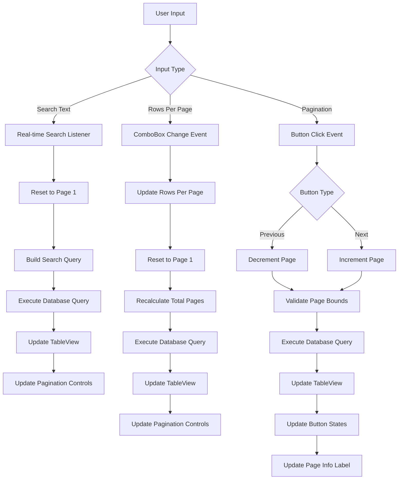

# JavaFX Customer Management System - Comprehensive Documentation

## Table of Contents
1. [Technology Stack Analysis](#technology-stack-analysis)
2. [Project Architecture Overview](#project-architecture-overview)
3. [Logic Flow Diagrams](#logic-flow-diagrams)
4. [Process Flow Documentation](#process-flow-documentation)
5. [Business Process Analysis](#business-process-analysis)
6. [Database Schema](#database-schema)
7. [Integration Points](#integration-points)
8. [Build and Deployment](#build-and-deployment)

## Technology Stack Analysis

### Core Technologies

#### JavaFX 21 Desktop Application
- **Framework**: JavaFX 21 with FXML-based UI architecture
- **Module System**: Java Platform Module System (JPMS) with `module-info.java`
- **UI Components**: TableView, ComboBox, TextField, Button, DatePicker
- **Event Handling**: FXML-based event binding with controller methods
- **Styling**: CSS-based styling with external stylesheet support

#### Maven 3.9 Project Structure
- **Build Tool**: Maven 3.9 with JavaFX Maven Plugin
- **Compiler**: Java 21 source and target compatibility
- **Packaging**: Modular JAR with jlink support for native packaging
- **Dependencies**: Centralized dependency management with version control

#### Apache POI 5.4.1 Integration
- **Excel Processing**: XLSX file import/export functionality
- **Workbook Management**: XSSFWorkbook for Excel 2007+ format support
- **Data Mapping**: Customer entity to Excel cell mapping
- **Error Handling**: Comprehensive import/export error tracking

#### JasperReports 6.20.6 Integration
- **Report Engine**: JasperReports with reflection-based implementation
- **Template System**: JRXML template files for report design
- **Export Formats**: PDF export with file chooser integration
- **Data Source**: JRBeanCollectionDataSource for customer data

#### MySQL 8 Database Integration
- **Connector**: MySQL Connector/J 9.3.0
- **Connection Management**: Singleton pattern with connection pooling
- **Transaction Handling**: Auto-commit with prepared statements
- **Schema**: Single table design with comprehensive customer data

#### Java 21 Features Implementation
- **Records**: Not currently used but available for future enhancements
- **Pattern Matching**: Available for switch expressions
- **Text Blocks**: Used in SQL query formatting
- **Sealed Classes**: Available for model hierarchy

## Project Architecture Overview

### Package Structure
```
com.tama.jfxcrud/
├── CrudApp.java                    # Main application entry point
├── controller/
│   ├── CustomerController.java     # Business logic controller
│   └── MainViewController.java     # UI event handler controller
├── dao/
│   └── CustomerDAO.java           # Data access layer
├── model/
│   └── Customer.java              # Entity model
├── util/
│   ├── DatabaseConnection.java    # Database connection management
│   ├── JasperReportsUtil.java     # Report generation utilities
│   ├── ExcelHandler.java          # Excel import/export
│   └── CSVHandler.java            # CSV import/export
└── view/
    ├── MainView.java              # Programmatic UI construction
    └── ConnectionSetupView.java   # Database connection dialog
```

### Resources Structure
```
resources/
├── com/tama/jfxcrud/
│   ├── main-view.fxml             # Main UI layout
│   └── styles.css                 # Application styling
└── reports/
    ├── customer_report.jrxml      # Main report template
    └── customer_report_simple.jrxml # Simplified report template
```

## Logic Flow Diagrams

### Application Startup Flow


### CRUD Operations Flow


### Data Import/Export Flow


### Search and Pagination Flow


## Process Flow Documentation

### Customer CRUD Operations

#### Create Customer Process
1. **User Initiates**: Click "Add Customer" button
2. **Dialog Display**: Show customer input dialog with form fields
3. **Data Validation**: 
   - NIK: Required, unique constraint
   - Name: Required, max 100 characters
   - Born Date: Optional, date picker validation
   - Active: Boolean checkbox
   - Salary: Integer, default 0
4. **Database Insert**: Execute INSERT statement with prepared statement
5. **UI Update**: Refresh TableView and show success message
6. **Error Handling**: Display validation errors or database exceptions

#### Read Customer Process (with Pagination)
1. **Query Construction**: Build SQL with LIMIT, OFFSET, and WHERE clauses
2. **Parameter Binding**: Bind search terms and pagination parameters
3. **Database Execution**: Execute query and count query simultaneously
4. **Data Mapping**: Convert ResultSet to Customer objects
5. **UI Population**: Update TableView with customer data
6. **Pagination Update**: Calculate and update pagination controls
7. **Status Update**: Update page info and record count labels

#### Update Customer Process
1. **Selection Validation**: Ensure customer is selected in TableView
2. **Pre-fill Dialog**: Load existing customer data into edit form
3. **User Modification**: Allow user to edit form fields
4. **Data Validation**: Same validation rules as create operation
5. **Database Update**: Execute UPDATE statement with WHERE clause
6. **Optimistic Locking**: Check affected rows to ensure update success
7. **UI Refresh**: Reload data and show success confirmation

#### Delete Customer Process
1. **Selection Validation**: Ensure customer is selected
2. **Confirmation Dialog**: Show delete confirmation with customer details
3. **User Confirmation**: Wait for user decision
4. **Database Delete**: Execute DELETE statement with customer ID
5. **Cascade Handling**: Handle any foreign key constraints
6. **UI Update**: Remove from TableView and show success message

### Data Import/Export Operations

#### Excel Import Process
1. **File Selection**: User selects XLSX file via FileChooser
2. **Workbook Loading**: Apache POI XSSFWorkbook loads the file
3. **Sheet Processing**: Read first sheet, skip header row
4. **Row Iteration**: Process each data row sequentially
5. **Cell Mapping**: Map cells to Customer entity fields:
   - Column 1: NIK (String)
   - Column 2: Name (String)
   - Column 3: Born Date (Date)
   - Column 4: Active (Boolean)
   - Column 5: Salary (Integer)
6. **Data Validation**: Validate each field according to business rules
7. **Database Insert**: Insert valid records, log failed records
8. **Result Reporting**: Show success/failure counts to user

#### Excel Export Process
1. **Data Retrieval**: Get filtered customer data from current view
2. **Workbook Creation**: Create new XSSFWorkbook instance
3. **Header Setup**: Create header row with column names
4. **Data Population**: Iterate through customers and populate rows
5. **Date Formatting**: Apply date formatting to born date cells
6. **File Saving**: Save workbook to user-selected location
7. **Success Notification**: Confirm export completion

#### PDF Report Generation Process
1. **Data Collection**: Gather filtered customer data
2. **Template Loading**: Load customer_report.jrxml template
3. **Report Compilation**: Compile JRXML to JasperReport using reflection
4. **Data Source Creation**: Create JRBeanCollectionDataSource from customer list
5. **Parameter Setup**: Set report parameters (title, generated by, total records)
6. **Report Filling**: Fill report with data using JasperFillManager
7. **PDF Export**: Export JasperPrint to PDF file
8. **File Handling**: Save to user-selected location or show preview

### Search and Filtering Operations

#### Real-time Search Process
1. **Text Listener**: TextField.textProperty() listener triggers on each keystroke
2. **Search Term Processing**: Extract and trim search text
3. **Query Building**: Construct SQL with LIKE clauses for multiple fields
4. **Parameter Binding**: Bind search term to all searchable fields:
   - NIK LIKE %searchTerm%
   - Name LIKE %searchTerm%
   - Born LIKE %searchTerm%
   - Active LIKE %searchTerm%
   - Salary LIKE %searchTerm%
5. **Pagination Reset**: Reset to page 1 for new search results
6. **Database Query**: Execute filtered query with pagination
7. **UI Update**: Update TableView and pagination controls

#### Pagination Management Process
1. **Page Calculation**: Calculate total pages based on filtered record count
2. **Offset Calculation**: Calculate SQL OFFSET = (currentPage - 1) * rowsPerPage
3. **Query Execution**: Execute paginated query with LIMIT and OFFSET
4. **Button State Management**: Enable/disable Previous/Next buttons
5. **Page Info Update**: Update "Page X of Y (Total records: Z)" label
6. **Navigation Handling**: Process Previous/Next button clicks with bounds checking

## Business Process Analysis

### Core Business Rules

#### Customer Data Management
- **Unique Identification**: NIK must be unique across all customers
- **Required Fields**: NIK and Name are mandatory for all customers
- **Data Integrity**: Born date cannot be in the future
- **Status Management**: Active flag determines customer operational status
- **Financial Tracking**: Salary field for compensation management

#### Data Import/Export Rules
- **Filtered Operations**: All export operations work on currently filtered/searched data
- **Error Tolerance**: Import operations continue processing despite individual record failures
- **Data Validation**: Strict validation during import to maintain data quality
- **Audit Trail**: Import/export operations provide detailed success/failure reporting

#### User Interface Rules
- **Connection Dependency**: All data operations require active database connection
- **Real-time Feedback**: Search and pagination provide immediate visual feedback
- **Error Handling**: User-friendly error messages for all failure scenarios
- **Data Consistency**: UI always reflects current database state after operations

### User Scenarios

#### Scenario 1: New Customer Registration
1. **Context**: HR department needs to register new employee
2. **Process**: Use Add Customer dialog to input employee details
3. **Validation**: System validates NIK uniqueness and required fields
4. **Outcome**: New customer record created with active status

#### Scenario 2: Bulk Data Import
1. **Context**: Migration from legacy system with Excel data
2. **Process**: Use Excel import functionality to process bulk data
3. **Validation**: System validates each record and reports failures
4. **Outcome**: Valid records imported, invalid records logged for correction

#### Scenario 3: Customer Report Generation
1. **Context**: Management needs customer report for specific criteria
2. **Process**: Apply search filters, then export to PDF
3. **Validation**: System ensures only filtered data is included
4. **Outcome**: PDF report generated with current filter criteria

#### Scenario 4: Data Maintenance
1. **Context**: Regular customer data updates and cleanup
2. **Process**: Use search to find specific customers, edit/delete as needed
3. **Validation**: System confirms destructive operations
4. **Outcome**: Customer data maintained with audit trail

## Database Schema

### Customer Table Structure
```sql
CREATE TABLE customer (
    idx INT AUTO_INCREMENT PRIMARY KEY,
    nik VARCHAR(20) NOT NULL UNIQUE,
    name VARCHAR(100) NOT NULL,
    born DATE,
    active BOOLEAN DEFAULT TRUE,
    salary INT DEFAULT 0
);
```

#### Field Specifications
- **idx**: Auto-incrementing primary key for internal identification
- **nik**: National Identification Number, unique business key
- **name**: Customer full name, required field
- **born**: Birth date, optional field for age calculations
- **active**: Status flag for operational customers
- **salary**: Compensation amount in integer format

#### Indexes and Constraints
- **Primary Key**: idx field for fast lookups
- **Unique Constraint**: nik field to prevent duplicates
- **NOT NULL Constraints**: nik and name fields are required
- **Default Values**: active=TRUE, salary=0 for new records

### Database Connection Management
- **Connection String**: `jdbc:mysql://localhost:3306/test`
- **Driver**: MySQL Connector/J 9.3.0
- **Connection Pooling**: Singleton pattern with connection validation
- **Transaction Management**: Auto-commit mode with prepared statements
- **Error Handling**: Connection retry logic with user feedback

## Integration Points

### JavaFX and FXML Integration
- **FXML Loading**: FXMLLoader loads main-view.fxml at application startup
- **Controller Binding**: @FXML annotations bind UI components to controller fields
- **Event Handling**: FXML onAction attributes link to controller methods
- **CSS Styling**: External stylesheet integration for consistent UI theming
- **Resource Management**: Resources loaded from classpath with proper module access

### Apache POI Integration
- **Dependency Management**: POI and POI-OOXML artifacts in Maven POM
- **Workbook Operations**: XSSFWorkbook for Excel 2007+ format handling
- **Cell Type Handling**: Automatic detection and conversion of cell types
- **Date Formatting**: Proper date cell formatting with CellStyle
- **Error Recovery**: Graceful handling of malformed Excel files

### JasperReports Integration
- **Reflection-based Loading**: Dynamic loading to avoid direct dependencies
- **Template Management**: JRXML templates stored in resources/reports
- **Data Source Integration**: JRBeanCollectionDataSource for Java object binding
- **Export Capabilities**: PDF export with file chooser integration
- **Parameter Passing**: Dynamic parameter injection for report customization

### MySQL Database Integration
- **JDBC Driver**: MySQL Connector/J with proper version compatibility
- **Connection Management**: Singleton pattern with connection validation
- **Prepared Statements**: SQL injection prevention with parameterized queries
- **Transaction Handling**: Auto-commit mode with rollback capabilities
- **Error Handling**: SQLException catching with user-friendly messages

## Build and Deployment

### Maven Configuration

#### Project Properties
```xml
<properties>
    <maven.compiler.source>21</maven.compiler.source>
    <maven.compiler.target>21</maven.compiler.target>
    <javafx.version>21</javafx.version>
    <junit.version>5.10.0</junit.version>
</properties>
```

#### Key Dependencies
- **JavaFX**: Controls, FXML, Web, Swing modules
- **Apache POI**: Core POI and OOXML for Excel processing
- **MySQL**: Connector/J for database connectivity
- **JasperReports**: Core engine and fonts
- **Logging**: Log4j for JasperReports logging

#### Build Plugins
- **Maven Compiler Plugin**: Java 21 source/target configuration
- **JavaFX Maven Plugin**: Application execution and packaging
- **Maven Wrapper**: Included for consistent build environment

### Application Execution

#### Development Mode
```bash
mvn clean javafx:run
```

#### Production Packaging
```bash
mvn clean package
mvn javafx:jlink
```

#### Module System Configuration
- **module-info.java**: Defines module dependencies and exports
- **Automatic Modules**: Handles non-modular dependencies
- **Service Loading**: Proper module access for reflection-based operations

### Deployment Considerations

#### System Requirements
- **Java Runtime**: Java 21 or higher
- **Database**: MySQL 8.0 or compatible
- **Memory**: Minimum 512MB heap for large datasets
- **Storage**: Adequate space for temporary files and exports

#### Configuration Management
- **Database Connection**: Configurable through connection dialog
- **File Paths**: User-selectable paths for import/export operations
- **Report Templates**: Bundled in application resources
- **Logging**: Configurable log levels for debugging

#### Performance Optimization
- **Connection Pooling**: Singleton database connection management
- **Lazy Loading**: On-demand resource loading
- **Memory Management**: Proper resource cleanup and disposal
- **Pagination**: Efficient data loading with LIMIT/OFFSET queries

## Key Features Summary

### Core Functionality
✅ **CRUD Operations**: Complete Create, Read, Update, Delete for customers
✅ **Search & Filter**: Real-time search across all customer fields
✅ **Pagination**: Configurable rows per page with navigation controls
✅ **Data Import**: Excel and CSV file import with validation
✅ **Data Export**: Excel, CSV, and PDF export of filtered data
✅ **Report Generation**: JasperReports-based PDF reports
✅ **Database Management**: MySQL integration with connection management

### Technical Highlights
✅ **Modern Java**: Java 21 with module system support
✅ **JavaFX 21**: Latest JavaFX with FXML-based UI
✅ **Maven Build**: Comprehensive build and dependency management
✅ **Error Handling**: Robust error handling with user feedback
✅ **Reflection Usage**: Dynamic loading for optional dependencies
✅ **Resource Management**: Proper cleanup and memory management

### User Experience Features
✅ **Intuitive UI**: Clean, responsive interface design
✅ **Real-time Feedback**: Immediate response to user actions
✅ **Data Validation**: Comprehensive input validation
✅ **Progress Indication**: Clear feedback for long-running operations
✅ **Error Messages**: User-friendly error reporting
✅ **Keyboard Navigation**: Full keyboard accessibility support

This comprehensive documentation provides a complete overview of the JavaFX Customer Management System, covering all aspects from technology stack to deployment considerations. The system demonstrates best practices in desktop application development with modern Java technologies.

## Code Implementation Examples

### Key Controller Methods

#### MainViewController Event Handlers
```java
@FXML
private void handleUploadExcel() {
    if (!DatabaseConnection.isConnected()) {
        showNotConnectedAlert();
        return;
    }

    FileChooser fileChooser = new FileChooser();
    fileChooser.setTitle("Select Excel File");
    fileChooser.getExtensionFilters().add(new FileChooser.ExtensionFilter("Excel Files", "*.xlsx"));
    File file = fileChooser.showOpenDialog(primaryStage);

    if (file != null) {
        Map<String, Integer> result = controller.importExcel(file);
        showAlert(Alert.AlertType.INFORMATION, "Import Result", "Excel Import Completed",
                String.format("Successfully imported: %d records\nFailed to import: %d records",
                        result.get("success"), result.get("failed")));
        loadData();
    }
}

@FXML
private void handleExportPDF() {
    try {
        List<Customer> filteredCustomers = controller.getCustomers(totalRecords, 0, currentSearch);

        if (filteredCustomers.isEmpty()) {
            showAlert(Alert.AlertType.INFORMATION, "No Data", "No Data to Export",
                     "There are no customers to export to PDF based on current filter.");
            return;
        }

        // Export to PDF - works on filtered data only
        JasperReportsUtil.exportToPDF(filteredCustomers, primaryStage);

    } catch (SQLException e) {
        showAlert(Alert.AlertType.ERROR, "Database Error", "Failed to load data for export", e.getMessage());
    }
}
```

#### CustomerDAO CRUD Implementation
```java
public List<Customer> getAllCustomers(int limit, int offset, String searchTerm) throws SQLException {
    List<Customer> customers = new ArrayList<>();
    String query = "SELECT * FROM customer WHERE 1=1";

    if (searchTerm != null && !searchTerm.isEmpty()) {
        query += " AND (nik LIKE ? OR name LIKE ? OR born LIKE ? OR CAST(active AS CHAR) LIKE ? OR CAST(salary AS CHAR) LIKE ?)";
    }

    query += " ORDER BY idx LIMIT ? OFFSET ?";

    Connection conn = DatabaseConnection.getConnection();
    try (PreparedStatement stmt = conn.prepareStatement(query)) {
        int paramIndex = 1;

        if (searchTerm != null && !searchTerm.isEmpty()) {
            String searchPattern = "%" + searchTerm + "%";
            for (int i = 0; i < 5; i++) {
                stmt.setString(paramIndex++, searchPattern);
            }
        }

        stmt.setInt(paramIndex++, limit);
        stmt.setInt(paramIndex, offset);

        ResultSet rs = stmt.executeQuery();
        while (rs.next()) {
            Customer customer = new Customer();
            customer.setIdx(rs.getInt("idx"));
            customer.setNik(rs.getString("nik"));
            customer.setName(rs.getString("name"));

            Date bornDate = rs.getDate("born");
            if (bornDate != null) {
                customer.setBorn(bornDate.toLocalDate());
            }

            customer.setActive(rs.getBoolean("active"));
            customer.setSalary(rs.getInt("salary"));
            customers.add(customer);
        }
    }

    return customers;
}

public void addCustomer(Customer customer) throws SQLException {
    String query = "INSERT INTO customer (nik, name, born, active, salary) VALUES (?, ?, ?, ?, ?)";

    Connection conn = DatabaseConnection.getConnection();
    try (PreparedStatement stmt = conn.prepareStatement(query)) {
        stmt.setString(1, customer.getNik());
        stmt.setString(2, customer.getName());
        stmt.setDate(3, customer.getBorn() != null ? Date.valueOf(customer.getBorn()) : null);
        stmt.setBoolean(4, customer.isActive());
        stmt.setInt(5, customer.getSalary());

        stmt.executeUpdate();
    }
}
```

#### JasperReports Reflection Implementation
```java
private static void compileReport() throws Exception {
    if (compiledReport == null) {
        InputStream reportStream = JasperReportsUtil.class.getResourceAsStream(REPORT_TEMPLATE);
        if (reportStream == null) {
            reportStream = JasperReportsUtil.class.getClassLoader().getResourceAsStream("reports/customer_report_simple.jrxml");
            if (reportStream == null) {
                throw new Exception("Report template not found: " + REPORT_TEMPLATE);
            }
        }

        try {
            // Use reflection to compile report
            Class<?> compileManagerClass = Class.forName("net.sf.jasperreports.engine.JasperCompileManager");
            var compileMethod = compileManagerClass.getMethod("compileReport", InputStream.class);
            compiledReport = compileMethod.invoke(null, reportStream);
        } finally {
            if (reportStream != null) {
                reportStream.close();
            }
        }
    }
}

public static Object generateReport(List<Customer> customers) throws Exception {
    compileReport();

    // Convert customers to Map format for easier handling
    List<Map<String, Object>> customerMaps = new ArrayList<>();
    for (Customer customer : customers) {
        Map<String, Object> customerMap = new HashMap<>();
        customerMap.put("idx", customer.getIdx());
        customerMap.put("nik", customer.getNik());
        customerMap.put("name", customer.getName());
        customerMap.put("born", customer.getBorn() != null ? customer.getBorn().toString() : "");
        customerMap.put("active", customer.isActive());
        customerMap.put("salary", customer.getSalary());
        customerMaps.add(customerMap);
    }

    // Create data source using reflection
    Class<?> dataSourceClass = Class.forName("net.sf.jasperreports.engine.data.JRBeanCollectionDataSource");
    var dataSourceConstructor = dataSourceClass.getConstructor(java.util.Collection.class);
    Object dataSource = dataSourceConstructor.newInstance(customerMaps);

    // Create parameters map
    Map<String, Object> parameters = new HashMap<>();
    parameters.put("ReportTitle", "Customer Management Report");
    parameters.put("GeneratedBy", "Customer Management System");
    parameters.put("TotalRecords", customers.size());

    // Fill the report using reflection
    Class<?> fillManagerClass = Class.forName("net.sf.jasperreports.engine.JasperFillManager");
    var fillMethod = fillManagerClass.getMethod("fillReport",
        Class.forName("net.sf.jasperreports.engine.JasperReport"),
        Map.class,
        Class.forName("net.sf.jasperreports.engine.JRDataSource"));

    return fillMethod.invoke(null, compiledReport, parameters, dataSource);
}
```

#### Excel Import/Export Implementation
```java
public Map<String, Integer> importExcel(File file) {
    Map<String, Integer> result = new HashMap<>();
    int success = 0;
    int failed = 0;

    try (FileInputStream fis = new FileInputStream(file);
         Workbook workbook = new XSSFWorkbook(fis)) {

        Sheet sheet = workbook.getSheetAt(0);
        boolean isFirstRow = true;

        for (Row row : sheet) {
            if (isFirstRow) {
                isFirstRow = false;
                continue; // Skip header
            }

            try {
                Customer customer = new Customer();

                // NIK
                Cell nikCell = row.getCell(1);
                if (nikCell != null) {
                    customer.setNik(getCellValueAsString(nikCell));
                }

                // Name
                Cell nameCell = row.getCell(2);
                if (nameCell != null) {
                    customer.setName(getCellValueAsString(nameCell));
                }

                // Born Date
                Cell bornCell = row.getCell(3);
                if (bornCell != null && bornCell.getCellType() == CellType.NUMERIC && DateUtil.isCellDateFormatted(bornCell)) {
                    Date date = bornCell.getDateCellValue();
                    customer.setBorn(date.toInstant().atZone(ZoneId.systemDefault()).toLocalDate());
                }

                // Active
                Cell activeCell = row.getCell(4);
                if (activeCell != null) {
                    customer.setActive(getCellValueAsBoolean(activeCell));
                }

                // Salary
                Cell salaryCell = row.getCell(5);
                if (salaryCell != null) {
                    customer.setSalary(getCellValueAsInteger(salaryCell));
                }

                customerDAO.addCustomer(customer);
                success++;
            } catch (Exception e) {
                failed++;
            }
        }

    } catch (IOException e) {
        e.printStackTrace();
        failed++;
    }

    result.put("success", success);
    result.put("failed", failed);
    return result;
}
```

### Database Connection Management
```java
public class DatabaseConnection {
    private static String URL = "jdbc:mysql://localhost:3306/test";
    private static String USER = "rangga";
    private static String PASSWORD = "rangga";

    private static Connection connection;

    public static Connection getConnection() throws SQLException {
        if (connection == null || connection.isClosed() || !connection.isValid(5)) {
            connection = DriverManager.getConnection(URL, USER, PASSWORD);
        }
        return connection;
    }

    public static boolean isConnected() {
        if (connection == null) return false;
        try {
            boolean closed = connection.isClosed();
            boolean valid = connection.isValid(5); // 5 second timeout
            return !closed && valid;
        } catch (SQLException e) {
            return false;
        }
    }

    public static void setConnectionParams(String host, String port, String database, String user, String password) {
        URL = String.format("jdbc:mysql://%s:%s/%s", host, port, database);
        USER = user;
        PASSWORD = password;
        closeConnection();
    }
}
```

## Setup and Configuration Guide

### Prerequisites
1. **Java 21** - Download from Oracle or OpenJDK
2. **Maven 3.9+** - For build management
3. **MySQL 8.0+** - Database server
4. **IDE** - IntelliJ IDEA recommended

### Database Setup
```sql
-- 1. Create database
CREATE DATABASE IF NOT EXISTS test;
USE test;

-- 2. Create customer table
CREATE TABLE customer (
    idx INT AUTO_INCREMENT PRIMARY KEY,
    nik VARCHAR(20) NOT NULL UNIQUE,
    name VARCHAR(100) NOT NULL,
    born DATE,
    active BOOLEAN DEFAULT TRUE,
    salary INT DEFAULT 0
);

-- 3. Insert sample data
INSERT INTO customer (nik, name, born, active, salary) VALUES
('1234567890123456', 'John Doe', '1990-01-15', TRUE, 5000000),
('2345678901234567', 'Jane Smith', '1985-03-22', TRUE, 7500000),
('3456789012345678', 'Bob Johnson', '1992-07-10', FALSE, 4500000);
```

### Project Setup
```bash
# 1. Clone or extract project
cd /path/to/CrudJFX

# 2. Verify Java version
java --version

# 3. Build project
mvn clean compile

# 4. Run application
mvn javafx:run
```

### Configuration Files

#### module-info.java
```java
module com.tama.jfxcrud {
    requires javafx.controls;
    requires javafx.fxml;
    requires javafx.web;
    requires javafx.swing;

    requires java.sql;
    requires java.desktop;
    requires org.apache.poi.poi;
    requires org.apache.poi.ooxml;

    opens com.tama.jfxcrud to javafx.fxml;
    opens com.tama.jfxcrud.controller to javafx.fxml;
    opens com.tama.jfxcrud.view to javafx.fxml;

    exports com.tama.jfxcrud;
    exports com.tama.jfxcrud.model;
    exports com.tama.jfxcrud.controller;
    exports com.tama.jfxcrud.view;
}
```

#### Key Maven Dependencies
```xml
<!-- JavaFX -->
<dependency>
    <groupId>org.openjfx</groupId>
    <artifactId>javafx-controls</artifactId>
    <version>21</version>
</dependency>

<!-- Apache POI for Excel -->
<dependency>
    <groupId>org.apache.poi</groupId>
    <artifactId>poi</artifactId>
    <version>5.4.1</version>
</dependency>
<dependency>
    <groupId>org.apache.poi</groupId>
    <artifactId>poi-ooxml</artifactId>
    <version>5.4.1</version>
</dependency>

<!-- MySQL Connector -->
<dependency>
    <groupId>com.mysql</groupId>
    <artifactId>mysql-connector-j</artifactId>
    <version>9.3.0</version>
</dependency>

<!-- JasperReports -->
<dependency>
    <groupId>net.sf.jasperreports</groupId>
    <artifactId>jasperreports</artifactId>
    <version>6.20.6</version>
</dependency>
```

## Troubleshooting Guide

### Common Issues and Solutions

#### 1. Database Connection Issues
**Problem**: "Connection refused" or "Access denied"
**Solutions**:
- Verify MySQL server is running: `sudo systemctl status mysql`
- Check connection parameters in DatabaseConnection.java
- Ensure user has proper privileges: `GRANT ALL PRIVILEGES ON test.* TO 'rangga'@'localhost';`
- Test connection manually: `mysql -u rangga -p -h localhost test`

#### 2. JavaFX Module Issues
**Problem**: "Module not found" errors
**Solutions**:
- Verify Java 21 is installed and JAVA_HOME is set
- Check module-info.java for missing requires statements
- Ensure JavaFX modules are in module path
- Use Maven wrapper: `./mvnw javafx:run`

#### 3. JasperReports Issues
**Problem**: "Template not found" or reflection errors
**Solutions**:
- Verify JRXML files are in src/main/resources/reports/
- Check JasperReports dependencies in pom.xml
- Ensure proper module access for reflection
- Test with simplified template first

#### 4. Excel Import/Export Issues
**Problem**: "File format not supported" or POI errors
**Solutions**:
- Verify file is .xlsx format (not .xls)
- Check Apache POI dependencies
- Ensure proper file permissions
- Validate Excel file structure matches expected format

#### 5. Build Issues
**Problem**: Maven compilation errors
**Solutions**:
- Clean and rebuild: `mvn clean compile`
- Update dependencies: `mvn dependency:resolve`
- Check Java version compatibility
- Verify Maven version: `mvn --version`

### Performance Tuning

#### Memory Optimization
```bash
# Increase heap size for large datasets
export MAVEN_OPTS="-Xmx2g -Xms512m"
mvn javafx:run
```

#### Database Optimization
```sql
-- Add indexes for better search performance
CREATE INDEX idx_customer_nik ON customer(nik);
CREATE INDEX idx_customer_name ON customer(name);
CREATE INDEX idx_customer_active ON customer(active);
```

#### Application Optimization
- Use pagination for large datasets (already implemented)
- Implement connection pooling for production
- Cache compiled JasperReports templates
- Optimize Excel processing for large files

## Reverse Engineering Checklist

### For New Developers

#### Understanding the Codebase
- [ ] Review package structure and class responsibilities
- [ ] Understand the MVC pattern implementation
- [ ] Study the database schema and relationships
- [ ] Analyze the Maven build configuration
- [ ] Review module system configuration

#### Key Implementation Patterns
- [ ] **Singleton Pattern**: DatabaseConnection class
- [ ] **DAO Pattern**: CustomerDAO for data access
- [ ] **MVC Pattern**: Separation of concerns
- [ ] **Observer Pattern**: JavaFX event handling
- [ ] **Factory Pattern**: FileChooser and Alert creation

#### Critical Integration Points
- [ ] **FXML Binding**: @FXML annotations and event handlers
- [ ] **Reflection Usage**: JasperReports dynamic loading
- [ ] **Resource Management**: Proper cleanup and disposal
- [ ] **Error Handling**: SQLException and IOException handling
- [ ] **Data Validation**: Input validation and business rules

#### Testing Strategy
- [ ] Unit tests for DAO methods
- [ ] Integration tests for database operations
- [ ] UI tests for JavaFX components
- [ ] End-to-end tests for import/export functionality
- [ ] Performance tests for large datasets

### Extension Points

#### Adding New Features
1. **New Entity Types**: Follow Customer model pattern
2. **Additional Reports**: Create new JRXML templates
3. **New Export Formats**: Extend handler pattern
4. **Enhanced Search**: Modify DAO query building
5. **User Management**: Add authentication layer

#### Customization Areas
1. **UI Themes**: Modify styles.css
2. **Database Schema**: Extend customer table
3. **Report Templates**: Customize JRXML files
4. **Connection Parameters**: Environment-based configuration
5. **Validation Rules**: Business logic customization

## Documentation Maintenance

### Keeping Documentation Updated
1. **Code Changes**: Update examples when implementation changes
2. **Dependency Updates**: Maintain version compatibility matrix
3. **New Features**: Document new functionality and integration points
4. **Bug Fixes**: Update troubleshooting guide
5. **Performance Improvements**: Document optimization techniques

### Version History
- **v1.0**: Initial implementation with basic CRUD
- **v1.1**: Added pagination and search functionality
- **v1.2**: Implemented Excel import/export
- **v1.3**: Added JasperReports PDF generation
- **v1.4**: Enhanced error handling and validation
- **Current**: Comprehensive documentation for reverse engineering

This documentation serves as a complete guide for understanding, maintaining, and extending the JavaFX Customer Management System. It provides all necessary information for successful reverse engineering and continued development.
